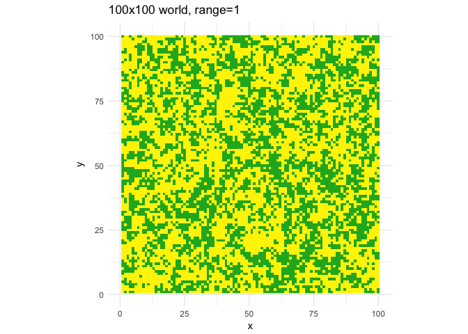
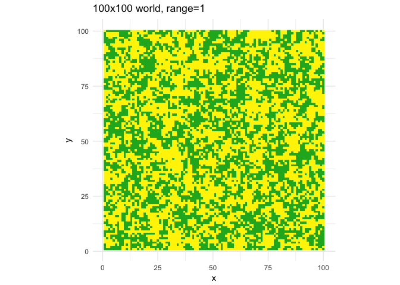
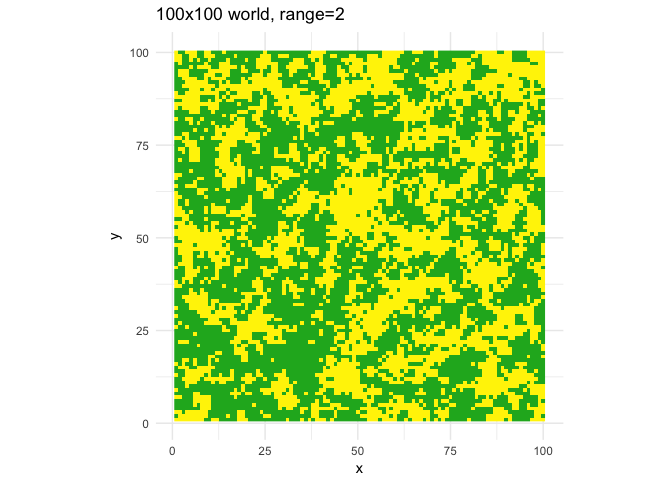
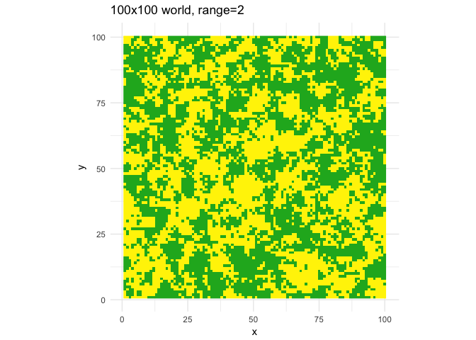
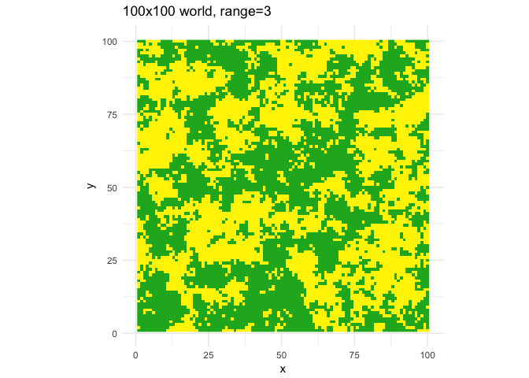
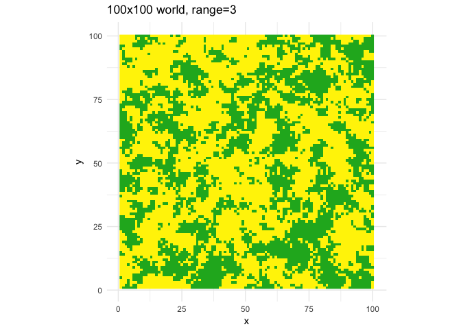
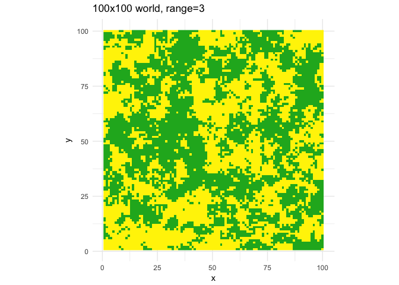
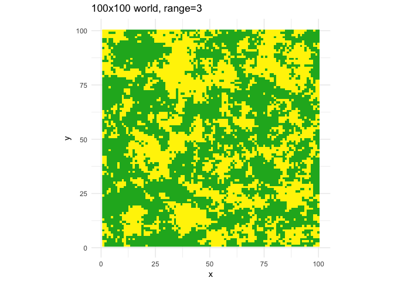
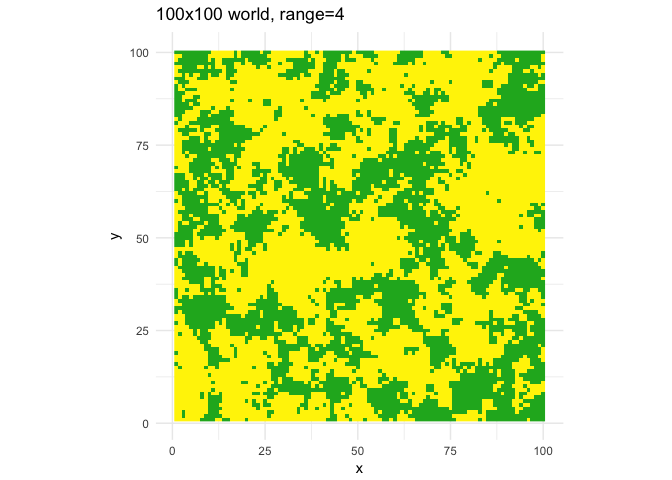

# readme
Andrew Barr  
9/19/2017  


```r
devtools::install_github("wabarr/simulateSpatialData")
library(simulateSpatialData)
```

## some examples

```r
invisible(
  lapply(sort(rep(1:10,4)), function(x){
  makeWorld(range=x)
})
)
```

```
## [using unconditional Gaussian simulation]
```

<!-- -->

```
## [using unconditional Gaussian simulation]
```

<!-- -->

```
## [using unconditional Gaussian simulation]
```

<!-- -->

```
## [using unconditional Gaussian simulation]
```

<!-- -->

```
## [using unconditional Gaussian simulation]
```

<!-- -->

```
## [using unconditional Gaussian simulation]
```

<!-- -->

```
## [using unconditional Gaussian simulation]
```

<!-- -->

```
## [using unconditional Gaussian simulation]
```

<!-- -->

```
## [using unconditional Gaussian simulation]
```

<!-- -->

```
## [using unconditional Gaussian simulation]
```

<!-- -->

```
## [using unconditional Gaussian simulation]
```

<!-- -->

```
## [using unconditional Gaussian simulation]
```

<!-- -->

```
## [using unconditional Gaussian simulation]
```

<!-- -->

```
## [using unconditional Gaussian simulation]
```

<!-- -->

```
## [using unconditional Gaussian simulation]
```

<!-- -->

```
## [using unconditional Gaussian simulation]
```

<!-- -->

```
## [using unconditional Gaussian simulation]
```

<!-- -->

```
## [using unconditional Gaussian simulation]
```

<!-- -->

```
## [using unconditional Gaussian simulation]
```

<!-- -->

```
## [using unconditional Gaussian simulation]
```

<!-- -->

```
## [using unconditional Gaussian simulation]
```

<!-- -->

```
## [using unconditional Gaussian simulation]
```

<!-- -->

```
## [using unconditional Gaussian simulation]
```

<!-- -->

```
## [using unconditional Gaussian simulation]
```

<!-- -->

```
## [using unconditional Gaussian simulation]
```

<!-- -->

```
## [using unconditional Gaussian simulation]
```

<!-- -->

```
## [using unconditional Gaussian simulation]
```

<!-- -->

```
## [using unconditional Gaussian simulation]
```

<!-- -->

```
## [using unconditional Gaussian simulation]
```

<!-- -->

```
## [using unconditional Gaussian simulation]
```

<!-- -->

```
## [using unconditional Gaussian simulation]
```

<!-- -->

```
## [using unconditional Gaussian simulation]
```

<!-- -->

```
## [using unconditional Gaussian simulation]
```

<!-- -->

```
## [using unconditional Gaussian simulation]
```

<!-- -->

```
## [using unconditional Gaussian simulation]
```

<!-- -->

```
## [using unconditional Gaussian simulation]
```

<!-- -->

```
## [using unconditional Gaussian simulation]
```

<!-- -->

```
## [using unconditional Gaussian simulation]
```

<!-- -->

```
## [using unconditional Gaussian simulation]
```

<!-- -->

```
## [using unconditional Gaussian simulation]
```

<!-- -->
