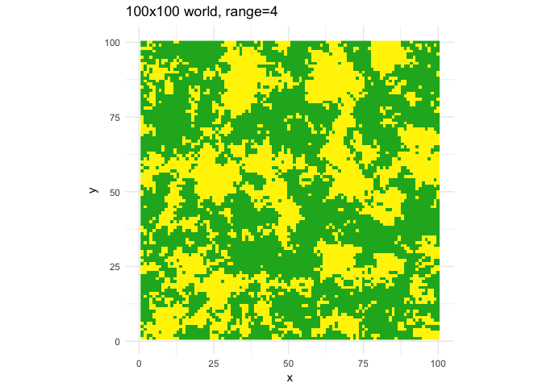

# readme
Andrew Barr  
9/19/2017  


```r
devtools::install_github("wabarr/simulateSpatialData")
library(simulateSpatialData)
```

## some examples

```r
makeWorld(range=1)
```

```
## [using unconditional Gaussian simulation]
```

<!-- -->

```r
makeWorld(range=1)
```

```
## [using unconditional Gaussian simulation]
```

<!-- -->

```r
makeWorld(range=1)
```

```
## [using unconditional Gaussian simulation]
```

<!-- -->

```r
makeWorld(range=2)
```

```
## [using unconditional Gaussian simulation]
```

<!-- -->

```r
makeWorld(range=2)
```

```
## [using unconditional Gaussian simulation]
```

<!-- -->

```r
makeWorld(range=2)
```

```
## [using unconditional Gaussian simulation]
```

<!-- -->

```r
makeWorld(range=3)
```

```
## [using unconditional Gaussian simulation]
```

<!-- -->

```r
makeWorld(range=3)
```

```
## [using unconditional Gaussian simulation]
```

<!-- -->

```r
makeWorld(range=3)
```

```
## [using unconditional Gaussian simulation]
```

<!-- -->

```r
makeWorld(range=4)
```

```
## [using unconditional Gaussian simulation]
```

<!-- -->

```r
makeWorld(range=4)
```

```
## [using unconditional Gaussian simulation]
```

<!-- -->

```r
makeWorld(range=4)
```

```
## [using unconditional Gaussian simulation]
```

<!-- -->

```r
makeWorld(range=5)
```

```
## [using unconditional Gaussian simulation]
```

<!-- -->

```r
makeWorld(range=5)
```

```
## [using unconditional Gaussian simulation]
```

<!-- -->

```r
makeWorld(range=5)
```

```
## [using unconditional Gaussian simulation]
```

<!-- -->
